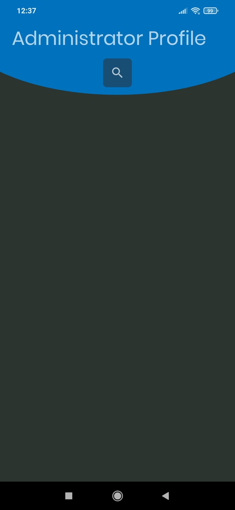

# Admin profile
Projeto tem como objetivo simular um perfil de administrador, onde o mesmo faz consultas da quantidade de perfis de deseja visualizar e consegue ter um paronama dos dados principais e não sensíveis, quando o mesmo clica no perfil ele tem acesso a uma área com dados mais sensiveis(não todos) para uma visualização do usuário.

## Capturas de Tela

## Tecnologias Utilizadas
* Glide: Biblioteca utilizada para carregar imagens.
* Volley: Biblioteca de rede para Android desenvolvida pelo Google. Facilita o processamento de solicitações HTTP em aplicativos Android, gerenciando cache, threads e processamento em segundo plano.
* Gson (Google Gson): Biblioteca Java do Google que simplifica a conversão entre objetos Java e formato JSON. É amplamente usada em aplicativos Android para analisar e manipular dados JSON de APIs da web.

## Instalação
1. Clone o repositório: [git clone](https://github.com/icecilia007/mobile-users.git)
2. Entre na pasta do projeto: cd Users
3. Abra no android studio [versão flamingo](https://developer.android.com/studio/releases?hl=pt-br)

## Como Contribuir
### Se quiser contribuir com o projeto, siga os passos abaixo:

1. Faça um fork do repositório
2. Crie uma branch para sua contribuição: git checkout -b sua_branch
3. Faça suas alterações e adições
4. Faça o commit das suas alterações: git commit -m 'Descrição das alterações'
5. Faça o push para o repositório remoto: git push origin sua_branch
6. Crie um novo Pull Request explicando suas alterações
